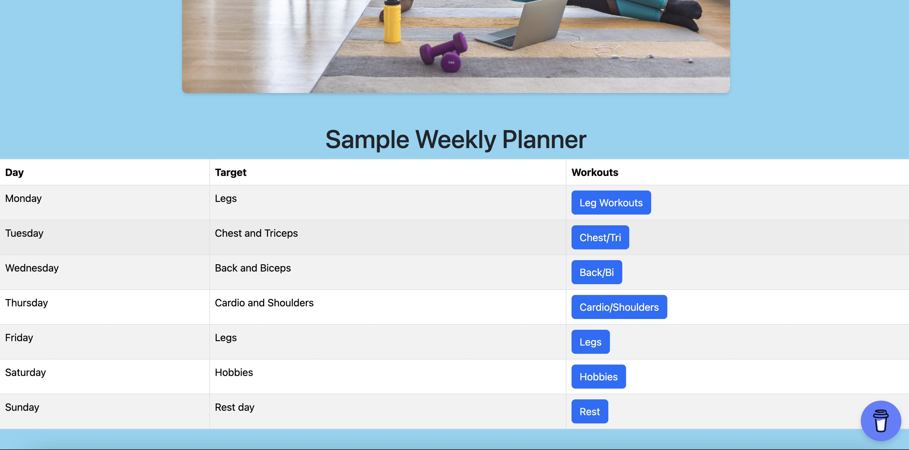
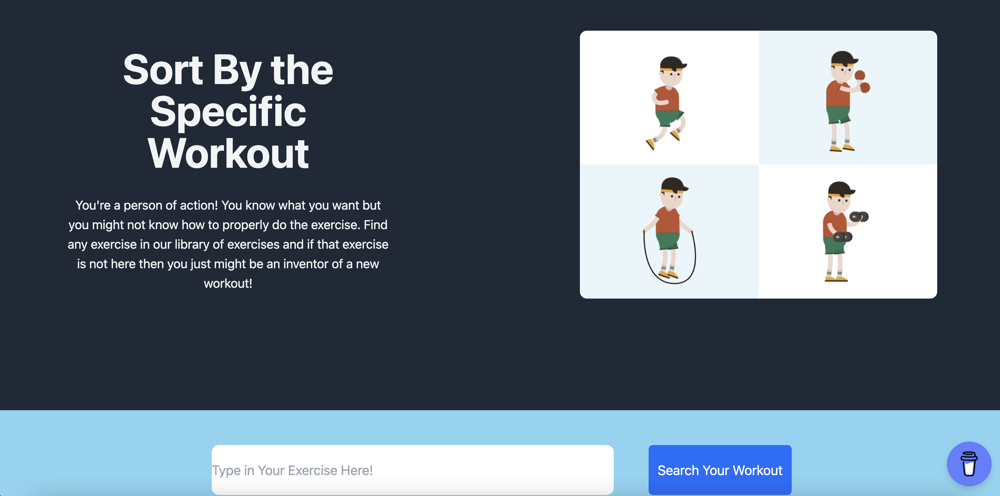

FitnessLife is a comprehensive fitness website designed to help you achieve your health and wellness goals. Within its pages, you'll discover a wide array of workouts accompanied by clear and concise written instructions, ensuring that you understand the proper techniques and form for each exercise. But that's not all – FitnessLife goes the extra mile by providing dynamic GIF tutorials that visually guide you through the motions, making it easier than ever to follow along. If you're unsure where to begin or need a structured approach, you'll also find a meticulously crafted weekly workout plan tailored to your needs. Whether you're a fitness novice or a seasoned pro, FitnessLife has something to offer everyone on their journey to a healthier, fitter you.

FitnessLife utilizes React Bootstrap, Mamba.UI, Tailwind CSS/UI as the libraries. 

Introduction Page:

Donation Setup used BuyMeACoffee:

Planner used React Bootstrap:

This is the search workout page:

This is grouping the buttons by the muscle groups.

This is grouping the buttons by equipment.

Testimonial, used Tailwind:

